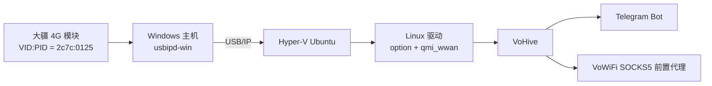

# 大疆 4G 模块运行 VoHive 教程：Mac 改 QMI 模式 + Windows Hyper-V Ubuntu 部署

这是一份从零开始的教程：把一台全新的大疆 4G 模块修改成 Linux / VoHive 可识别的 `2c7c:0125`，然后把它插在 Windows 小主机上，通过 Hyper-V Ubuntu 运行 VoHive。

本文适合你想要这样的最终效果：

- 大疆 4G 模块插在 Windows 主机 USB 口；
- Hyper-V 里的 Ubuntu 能识别到模块；
- Ubuntu 中出现 `/dev/cdc-wdm0`、`/dev/ttyUSB*`、`wwan0`；
- VoHive 可以管理设备、收发短信、使用 VoWiFi；
- 插拔设备后可以自动恢复。

> 本文参考项目：
>
> - [wlzh/dji-4g-vohive-mac](https://github.com/wlzh/dji-4g-vohive-mac)
> - [hey1874/eg25g-toolset](https://github.com/hey1874/eg25g-toolset)
> - [dorssel/usbipd-win](https://github.com/dorssel/usbipd-win)

## 目录

- [一、整体原理](#一整体原理)
- [二、准备环境](#二准备环境)
- [三、在 Mac 上把全新大疆模块改成 Linux 可用模式](#三在-mac-上把全新大疆模块改成-linux-可用模式)
- [四、在 Windows 上共享 USB 设备](#四在-windows-上共享-usb-设备)
- [五、在 Hyper-V Ubuntu 中接入 USB 设备](#五在-hyper-v-ubuntu-中接入-usb-设备)
- [六、安装并启动 VoHive](#六安装并启动-vohive)
- [七、配置 VoWiFi 前置代理](#七配置-vowifi-前置代理)
- [八、配置 Telegram Bot](#八配置-telegram-bot)
- [九、设置 USB/IP 自动重连](#九设置-usbip-自动重连)
- [十、日常使用和换设备](#十日常使用和换设备)
- [十一、常见故障排查](#十一常见故障排查)
- [十二、发布到 GitHub 前的安全提醒](#十二发布到-github-前的安全提醒)

## 一、整体原理

大疆 4G 模块本质上是 Quectel / Baiwang 类蜂窝模块。要让 VoHive 在 Linux 中使用它，关键是让模块工作在 QMI 模式，并让 Linux 识别出 QMI 控制口、AT 串口和蜂窝网卡。

最终链路如下：



这里有两个关键点：

1. 全新模块可能不是 `2c7c:0125`，需要先在 Mac 上修改一次。
2. Hyper-V 不能像 VMware / UTM 那样直接把 USB 设备透传给 Linux，所以需要借助 `usbipd-win`。

## 二、准备环境

### 硬件

- 大疆 4G 模块
- 一台 Mac，用于第一次修改模块 USB 模式
- 一台 Windows 小主机，用于长期插模块
- Windows 上的 Hyper-V Ubuntu 虚拟机

### 软件

Mac：

- Homebrew
- Python 3
- `libusb`
- `pyusb`
- `eg25g-toolset`

Windows：

- Windows 10 / Windows 11
- 管理员 PowerShell
- `usbipd-win`

Ubuntu：

- Ubuntu 22.04 / 24.04
- root 权限
- 能访问 Windows 主机 IP

## 三、在 Mac 上把全新大疆模块改成 Linux 可用模式

这一节使用 [hey1874/eg25g-toolset](https://github.com/hey1874/eg25g-toolset)。它的 README 说明这个工具可以在 macOS 上通过 Python + libusb 直接修改大疆 4G 模块的 VID/PID、切换 QMI / ECM / MBIM 模式，并发送 AT 命令。

### 3.1 安装依赖

在 Mac 终端执行：

```bash
brew install libusb
pip3 install pyusb flask
```

拉取工具：

```bash
git clone https://github.com/hey1874/eg25g-toolset.git
cd eg25g-toolset
```

### 3.2 插入大疆模块并确认当前状态

把全新的大疆 4G 模块插到 Mac。

查看 USB 信息：

```bash
system_profiler SPUSBDataType | grep -A5 -i "0x2ca3\\|0x2c7c\\|Baiwang\\|Quectel"
```

常见状态有两种：

```text
2ca3:4006
```

表示还不是 Linux / VoHive 友好的模式，需要继续修改。

```text
2c7c:0125
```

表示已经是目标模式，可以跳过修改，直接进入 Windows / Hyper-V 部署。

### 3.3 使用 eg25g-toolset 切换到 QMI 模式

先查看模块信息：

```bash
python3 eg25g.py info
```

切换到 QMI 模式：

```bash
python3 eg25g.py mode qmi
```

`eg25g-toolset` 的 CLI 中，`mode qmi` 对应 Linux / VoHive 使用的 QMI 模式。

### 3.4 如果 CLI 模式切换不成功，直接发送 VID/PID 修改指令

有些设备第一次状态比较特殊，可以直接使用工具 README 中的 libusb 方式发送 AT 指令。

```bash
python3 -c "
import usb.core, time

dev = usb.core.find(idVendor=0x2ca3, idProduct=0x4006)
if dev is None:
    raise SystemExit('未找到 2ca3:4006 设备；如果已经是 2c7c:0125，可跳过此步骤')

dev.set_configuration()

def at(cmd):
    data = (cmd + '\r\n').encode()
    dev.write(0x03, data, timeout=5000)
    time.sleep(1.5)
    return bytes(dev.read(0x84, 4096, timeout=5000)).decode(errors='replace')

print(at('AT'))
print(at('AT+QCFG=\"usbcfg\",0x2C7C,0x0125,1,1,1,1,1,0,0'))
dev.write(0x03, b'AT+CFUN=1,1\r\n', timeout=2000)
print('完成，模块会重启并重新枚举为 2c7c:0125')
"
```

等待模块重启，重新插拔一次也可以。

### 3.5 验证 Mac 已经看到 2c7c:0125

```bash
system_profiler SPUSBDataType | grep -A5 -i "0x2c7c\\|Baiwang\\|Quectel"
```

看到类似结果即可：

```text
Product ID: 0x0125
Vendor ID: 0x2c7c
```

到这里，模块已经被改成 Linux / VoHive 可识别的形态。这个修改是写进模块里的，不是只对当前 Mac 生效。之后把它插到 Windows、Linux 或其他机器上，都会以 `2c7c:0125` 枚举。

## 四、在 Windows 上共享 USB 设备

Hyper-V 默认不能直接把普通 USB 设备透传给 Ubuntu。这里用 `usbipd-win` 把 Windows 上的 USB 设备通过 USB/IP 共享给虚拟机。

### 4.1 安装 usbipd-win

打开“管理员 PowerShell”，执行：

```powershell
winget install --exact dorssel.usbipd-win
```

安装完成后，关闭 PowerShell，重新打开一个管理员 PowerShell。

验证：

```powershell
usbipd list
```

如果提示找不到 `usbipd`，通常是环境变量还没刷新，重新打开 PowerShell 即可。

### 4.2 找到大疆模块

插入已经改好的大疆模块。

执行：

```powershell
usbipd list
```

你应该看到类似：

```text
Connected:
BUSID  VID:PID    DEVICE    STATE
1-5    2c7c:0125  Baiwang   Not shared
```

重点看两列：

- `VID:PID` 必须是 `2c7c:0125`
- `STATE` 如果是 `Not shared`，需要共享

### 4.3 共享设备

把 `<BUSID>` 替换成你自己看到的值：

```powershell
usbipd bind --busid <BUSID>
```

例如：

```powershell
usbipd bind --busid 1-5
```

再次查看：

```powershell
usbipd list
```

期望变成：

```text
1-5    2c7c:0125  Baiwang   Shared
```

## 五、在 Hyper-V Ubuntu 中接入 USB 设备

### 5.1 安装 USB/IP 工具

进入 Ubuntu，安装工具：

```bash
sudo apt update
sudo apt install -y linux-tools-generic linux-tools-$(uname -r) usbutils
```

加载内核模块：

```bash
sudo modprobe vhci-hcd
```

如果这一步提示找不到 `usbip`，优先确认安装了和当前内核匹配的：

```bash
sudo apt install -y linux-tools-$(uname -r)
```

### 5.2 查看 Windows 共享出来的设备

把 `<Windows主机IP>` 替换成 Windows 小主机的 IP：

```bash
sudo usbip list --remote=<Windows主机IP>
```

期望看到：

```text
1-5: Quectel Wireless Solutions Co., Ltd. : EC25 LTE modem (2c7c:0125)
```

### 5.3 接入设备

```bash
sudo usbip attach --remote=<Windows主机IP> --busid=<BUSID>
```

其中 `<BUSID>` 是上一步看到的值，例如 `1-5`。

### 5.4 验证 Linux 已经识别

```bash
usbip port
lsusb
lsusb -t
ls -l /dev/cdc-wdm* /dev/ttyUSB*
ip link show
```

正常情况下，你应该看到：

```text
2c7c:0125 Quectel Wireless Solutions Co., Ltd. EC25 LTE modem
```

并且存在：

```text
/dev/cdc-wdm0
/dev/ttyUSB0
/dev/ttyUSB1
/dev/ttyUSB2
/dev/ttyUSB3
wwan0
```

`lsusb -t` 中应能看到驱动：

```text
Driver=option
Driver=qmi_wwan
```

### 5.5 禁用 ModemManager

如果系统安装了 `ModemManager`，建议禁用。它可能抢占 AT / QMI 接口，导致 VoHive 报错。

```bash
sudo systemctl disable --now ModemManager
```

## 六、安装并启动 VoHive

本教程以 `/opt/vohive` 为安装目录。VoHive 具体版本请以项目发布页为准。

### 6.1 创建目录

```bash
sudo mkdir -p /opt/vohive/bin /opt/vohive/config /opt/vohive/data /opt/vohive/logs
```

下载适合当前 CPU 架构的 VoHive 二进制文件，放到：

```text
/opt/vohive/bin/vohive
```

赋予执行权限：

```bash
sudo chmod +x /opt/vohive/bin/vohive
```

### 6.2 创建 systemd 服务

```bash
sudo tee /etc/systemd/system/vohive.service >/dev/null <<'EOF'
[Unit]
Description=VoHive
After=network-online.target
Wants=network-online.target

[Service]
Type=simple
WorkingDirectory=/opt/vohive
ExecStart=/opt/vohive/bin/vohive
Restart=always
RestartSec=3

[Install]
WantedBy=multi-user.target
EOF
```

启动：

```bash
sudo systemctl daemon-reload
sudo systemctl enable --now vohive
```

查看日志：

```bash
journalctl -u vohive -f
```

Web UI 默认地址：

```text
http://<Ubuntu-IP>:7575
```

### 6.3 如果是从旧机器迁移

如果你已经有一台旧机器跑过 VoHive，可以迁移配置和数据库。

需要迁移：

```text
/opt/vohive/config/
/opt/vohive/data/vohive.db
/opt/vohive/data/mcc-mnc-table.json
```

建议先在旧机器上做 SQLite 在线备份：

```bash
sqlite3 /opt/vohive/data/vohive.db ".backup '/tmp/vohive.db.backup'"
```

打包：

```bash
sudo tar czf /tmp/vohive-backup.tar.gz \
  -C /opt/vohive config data/mcc-mnc-table.json \
  -C /tmp vohive.db.backup
```

复制到新机器后：

```bash
sudo systemctl stop vohive
sudo tar xzf /tmp/vohive-backup.tar.gz -C /opt/vohive
sudo mv /opt/vohive/vohive.db.backup /opt/vohive/data/vohive.db
sudo chown -R root:root /opt/vohive
sudo chmod 600 /opt/vohive/config/config.yaml
sudo systemctl start vohive
```

验证数据库：

```bash
sqlite3 /opt/vohive/data/vohive.db "PRAGMA integrity_check;"
```

返回：

```text
ok
```

## 七、配置 VoWiFi 前置代理

VoHive 里有两个代理概念，别填错：

### 本地出站代理

这是把 SIM 卡网络共享出来给其他设备用：

```text
其他设备 -> VoHive -> SIM 卡网络
```

### VoWiFi 漫游前置代理

这是 VoHive 连接运营商 ePDG 时使用的外部 SOCKS5 代理：

```text
VoHive -> SOCKS5 -> 运营商 ePDG
```

如果你是为了 VoWiFi，SOCKS5 应该填到“VoWiFi 漫游前置代理”。

### SOCKS5 代理要求

这个 SOCKS5 必须支持：

- TCP CONNECT
- UDP ASSOCIATE
- 返回一个 VoHive 能访问到的 UDP relay 地址

如果代理返回：

```text
127.0.0.1
```

通常是不行的。因为 VoHive 在另一台机器上，`127.0.0.1` 指向的是 VoHive 自己，不是代理服务器。

正确情况应该返回：

- 代理服务器公网 IP；或
- VoHive 能访问到的内网 IP。

VoWiFi 成功时，日志里一般能看到：

```text
IPsec Child SA 成功
IMS REGISTER 200
IMS SMS capability ready
```

## 八、配置 Telegram Bot

### 8.1 获取 Bot Token

在 Telegram 找 BotFather，创建或复用一个 Bot，获得：

```text
<BOT_TOKEN>
```

不要把真实 Token 写进公开仓库。

### 8.2 获取 chat_id

先给 Bot 发一条消息，例如：

```text
/start
```

然后查询：

```bash
curl "https://api.telegram.org/bot<BOT_TOKEN>/getUpdates"
```

返回内容中可以找到 `chat.id`。

### 8.3 写入 VoHive 配置

示例：

```yaml
telegram:
  enabled: true
  bot_token: "<BOT_TOKEN>"
  chat_id: "<CHAT_ID>"
  admin_id: "<ADMIN_ID>"
```

如果服务器访问 Telegram 官方 API 不稳定，可以配置反代：

```yaml
telegram:
  base_url: "https://<你的Telegram反代域名>"
```

测试反代是否可用：

```bash
curl "https://<你的Telegram反代域名>/bot<BOT_TOKEN>/getMe"
```

返回 `ok: true` 才说明路径正确。

### 8.4 替换旧 Bot 菜单命令

如果这个 Bot 之前给别的服务用过，菜单命令可能还是旧的。可以用 Bot API 重设：

```bash
curl -X POST "https://api.telegram.org/bot<BOT_TOKEN>/setMyCommands" \
  -H "Content-Type: application/json" \
  -d '{
    "commands": [
      {"command": "list", "description": "设备列表"},
      {"command": "status", "description": "设备状态"},
      {"command": "sms", "description": "查看短信"},
      {"command": "send", "description": "发送短信"},
      {"command": "rotate", "description": "切换/轮换"},
      {"command": "esim", "description": "eSIM 管理"},
      {"command": "switch", "description": "切换设备"},
      {"command": "vocall", "description": "语音相关"}
    ]
  }'
```

注意：同一个 Bot 不建议同时被两个 VoHive 实例轮询，否则可能出现 `getUpdates` 冲突。

## 九、设置 USB/IP 自动重连

Windows 侧 `usbipd bind` 通常是持久的，但 Ubuntu 侧 `usbip attach` 重启后会丢。为了让系统重启或设备短暂断开后自动恢复，可以加一个 systemd timer。

### 9.1 创建自动 attach 脚本

```bash
sudo tee /usr/local/sbin/attach-baiwang-usbip >/dev/null <<'EOF'
#!/bin/sh
set -eu

host="<Windows主机IP>"

modprobe vhci-hcd

if usbip port 2>/dev/null | grep -q '2c7c:0125'; then
    exit 0
fi

devices="$(usbip list --remote="$host" 2>/dev/null || true)"
busid="$(printf '%s\n' "$devices" | awk '/2c7c:0125/ { gsub(":", "", $1); print $1; exit }')"

if [ -z "$busid" ]; then
    echo "Baiwang 2c7c:0125 is not exported by $host" >&2
    exit 1
fi

usbip attach --remote="$host" --busid="$busid"
EOF
```

修改脚本里的：

```text
<Windows主机IP>
```

然后授权：

```bash
sudo chmod +x /usr/local/sbin/attach-baiwang-usbip
```

### 9.2 创建 systemd service

```bash
sudo tee /etc/systemd/system/usbip-baiwang.service >/dev/null <<'EOF'
[Unit]
Description=Attach Baiwang EC25 from Windows usbipd
After=network-online.target
Wants=network-online.target

[Service]
Type=oneshot
ExecStart=/usr/local/sbin/attach-baiwang-usbip
EOF
```

### 9.3 创建 systemd timer

```bash
sudo tee /etc/systemd/system/usbip-baiwang.timer >/dev/null <<'EOF'
[Unit]
Description=Keep Baiwang EC25 attached over USB/IP

[Timer]
OnBootSec=10s
OnUnitActiveSec=30s
AccuracySec=5s
Unit=usbip-baiwang.service

[Install]
WantedBy=timers.target
EOF
```

启用：

```bash
sudo systemctl daemon-reload
sudo systemctl enable --now usbip-baiwang.timer
```

### 9.4 让 VoHive 等 USB/IP 先接入

编辑 VoHive 的 systemd override：

```bash
sudo systemctl edit vohive
```

填入：

```ini
[Unit]
After=network-online.target usbip-baiwang.service
Wants=network-online.target usbip-baiwang.service
```

重载：

```bash
sudo systemctl daemon-reload
sudo systemctl restart vohive
```

## 十、日常使用和换设备

### 10.1 直接拔掉再插回同一个 USB 口

通常不用额外操作。

等待 30～60 秒，Ubuntu 的 timer 会自动尝试重新接入。

### 10.2 换另一台已经改好的大疆模块

只要另一台设备也是：

```text
2c7c:0125
```

就可以识别。

Windows 上查看：

```powershell
usbipd list
```

如果是 `Shared`，等 Ubuntu 自动接入即可。

如果是 `Not shared`，执行：

```powershell
usbipd bind --busid <BUSID>
```

### 10.3 插到 Windows 的其他 USB 口

换 USB 口后，`BUSID` 可能变化。

重新执行：

```powershell
usbipd list
```

如果新 USB 口对应的设备是 `Not shared`，重新 bind：

```powershell
usbipd bind --busid <新的BUSID>
```

### 10.4 判断模块是否已经改好

已经改好：

```text
2c7c:0125
```

还需要修改：

```text
2ca3:4006
```

## 十一、常见故障排查

### 11.1 Windows 上找不到 usbipd 命令

重新打开管理员 PowerShell。

如果仍然不行，确认安装是否成功：

```powershell
winget list dorssel.usbipd-win
```

### 11.2 Windows 上设备是 Not shared

执行：

```powershell
usbipd bind --busid <BUSID>
```

### 11.3 Ubuntu 里 usbip 不可用

安装当前内核对应工具：

```bash
sudo apt install -y linux-tools-generic linux-tools-$(uname -r)
```

### 11.4 Ubuntu attach 成功但没有 /dev/cdc-wdm0

先看驱动：

```bash
lsusb -t
```

手动加载：

```bash
sudo modprobe option
sudo modprobe qmi_wwan
```

再检查：

```bash
ls -l /dev/cdc-wdm* /dev/ttyUSB*
```

### 11.5 VoHive 报 QMI Core 等待超时

常见原因：

- USB/IP 没 attach 成功；
- `/dev/cdc-wdm0` 不存在；
- `ModemManager` 抢占；
- `qmi-proxy` 残留；
- 模块刚重启，接口还没稳定。

可以按下面顺序恢复：

```bash
sudo systemctl stop vohive
sudo pkill -x qmi-proxy || true
sudo fuser -v /dev/cdc-wdm0 || true
sudo systemctl start vohive
```

如果安装了 `ModemManager`：

```bash
sudo systemctl disable --now ModemManager
```

### 11.6 VoWiFi 显示 IMS / SMS 未就绪

优先检查 SOCKS5：

- 是否支持 UDP ASSOCIATE；
- 返回的 UDP relay 是否是可达 IP；
- 是否错误返回 `127.0.0.1`；
- 防火墙是否放行 UDP；
- 代理服务是否稳定。

### 11.7 Telegram 菜单还是旧命令

使用 `setMyCommands` 重新设置。

如果多个服务共用同一个 Bot，建议只保留一个服务启用 Telegram 轮询。

### 11.8 PowerShell 中 `%USERNAME%` 不生效

`%USERNAME%` 是 CMD 语法。PowerShell 应使用：

```powershell
net user $env:USERNAME
```

检查当前 PowerShell 是否管理员：

```powershell
([Security.Principal.WindowsPrincipal][Security.Principal.WindowsIdentity]::GetCurrent()).IsInRole(
  [Security.Principal.WindowsBuiltInRole]::Administrator
)
```

返回 `True` 才是管理员 PowerShell。

## 十二、发布到 GitHub 前的安全提醒

不要把以下内容提交到公开仓库：

- SSH 密码
- Telegram Bot Token
- SOCKS5 用户名和密码
- 代理服务器真实地址
- SIM 卡 IMSI / ICCID / 手机号
- VoHive 数据库原文件

建议统一写成占位符：

```text
<Windows主机IP>
<Ubuntu-IP>
<BOT_TOKEN>
<CHAT_ID>
<SOCKS5_HOST>
<SOCKS5_USER>
<SOCKS5_PASSWORD>
```

如果 Token 曾经出现在公开仓库，建议立即重新生成。

## 最终检查清单

- [ ] Mac 上已把模块改成 `2c7c:0125`
- [ ] Windows `usbipd list` 能看到 `2c7c:0125`
- [ ] Windows 设备状态是 `Shared`
- [ ] Ubuntu `usbip port` 能看到接入设备
- [ ] Ubuntu `lsusb` 能看到 `2c7c:0125`
- [ ] Ubuntu 存在 `/dev/cdc-wdm0`
- [ ] Ubuntu 存在 `/dev/ttyUSB0` ~ `/dev/ttyUSB3`
- [ ] Ubuntu 存在 `wwan0`
- [ ] `ModemManager` 已禁用
- [ ] VoHive Web UI 可以打开
- [ ] VoHive 能识别设备
- [ ] VoWiFi IMS / SMS 就绪
- [ ] Telegram Bot 可以正常收发通知
- [ ] USB/IP 自动重连 timer 已启用

